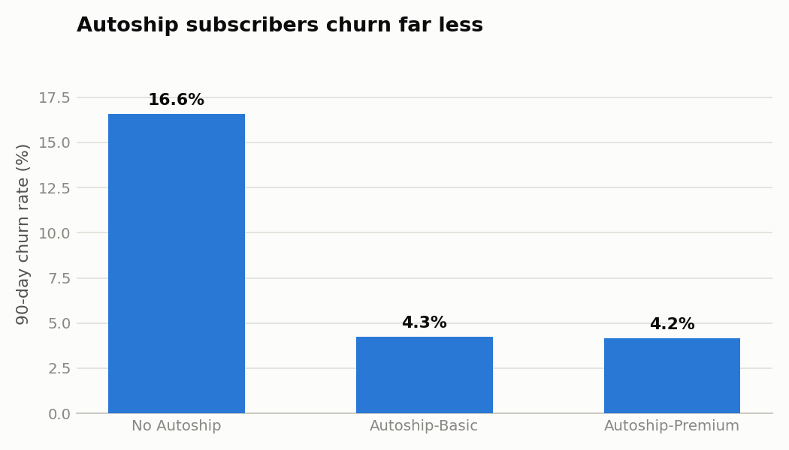

# 🐾 Chewy Customer Churn Prediction

An end-to-end machine learning project predicting which Chewy customers are likely to churn
in the next 90 days — built with **PySpark**, **PyTorch**, and **TensorFlow**.

<p align="center">
  
</p>

## Why churn?

[Chewy](https://www.chewy.com) is the largest online pet retailer in the U.S. Its Autoship
subscription program drives **≈83% of net sales** (public FY2025 filings), so retaining existing
customers *is* the business model. A model that ranks customers by churn risk lets the retention
team intervene before a cancellation instead of after.

## Project highlights

- **PySpark ETL pipeline** — deduplication, median imputation, and Spark-SQL feature engineering
  (`order_gap_ratio`, `spend_per_pet`, `engagement_score`, `service_friction`) that scales
  unchanged from 50K rows to Chewy's real ~20M customers
- **Two deep-learning frameworks, one architecture** — a class-weighted MLP implemented in both
  PyTorch (manual training loop, early stopping) and TensorFlow/Keras, evaluated head-to-head
- **Honest baseline** — logistic regression with the same features
- **Business translation** — top-decile targeting analysis, lift, and a net-dollar-value estimate

## Repository structure

```
├── notebooks/
│   └── Chewy_Customer_Churn_Prediction.ipynb   ← main deliverable (run in Google Colab)
├── data/
│   └── chewy_customers.csv                     ← synthetic dataset (50,000 customers)
├── src/
│   ├── generate_data.py                        ← dataset generator
│   ├── spark_etl.py                            ← PySpark cleaning + feature engineering
│   ├── train_pytorch.py                        ← PyTorch model training
│   ├── train_tensorflow.py                     ← TensorFlow model training
│   ├── eda_charts.py                           ← report figures
│   └── viz_style.py                            ← shared chart style
├── figures/                                    ← generated charts
├── reports/                                    ← PDF project report
└── presentation/                               ← PowerPoint slide deck
```

## Quick start

**Option A — Google Colab (recommended):**
open `notebooks/Chewy_Customer_Churn_Prediction.ipynb` in Colab and *Runtime → Run all*.
The notebook is fully self-contained (it generates its own data) and finishes in ~5 minutes on CPU.

**Option B — locally:**

```bash
pip install -r requirements.txt
cd src
python generate_data.py
python spark_etl.py
python train_pytorch.py
python train_tensorflow.py
```

## The data

No public dataset of Chewy customers exists (customer records are proprietary), so the project uses
a **synthetic dataset** generated from public business facts. All feature→churn relationships are
generated causally (e.g., unresolved support tickets raise churn; Autoship membership and pharmacy
purchases lower it), with noise, ~1.5% missing values, and duplicate rows for the ETL stage to clean.

| | |
|---|---|
| Customers | 50,000 |
| Raw columns | 22 |
| Churn rate | ≈11% |
| Missingness | ~1.5% in three columns |

## Results (test set)

| Model | ROC-AUC | PR-AUC |
|-------|---------|--------|
| PyTorch MLP | see `reports/` | |
| TensorFlow MLP | see `reports/` | |
| Logistic Regression | see `reports/` | |

Top-decile targeting: the model concentrates the majority of true churners into the top 10% of
risk scores — full numbers, charts, and the dollar-impact model are in the notebook and the PDF
report in `reports/`.

## Disclaimer

This is an independent portfolio project. It is not affiliated with, endorsed by, or based on
internal data from Chewy, Inc. All customer data is synthetic.
